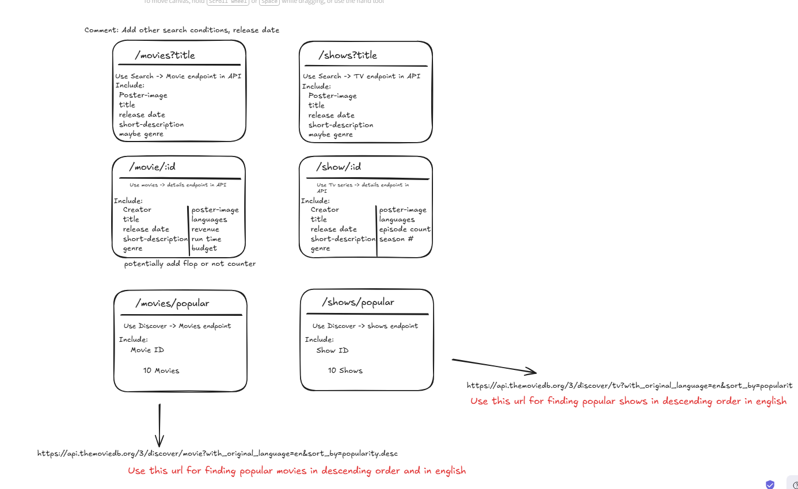
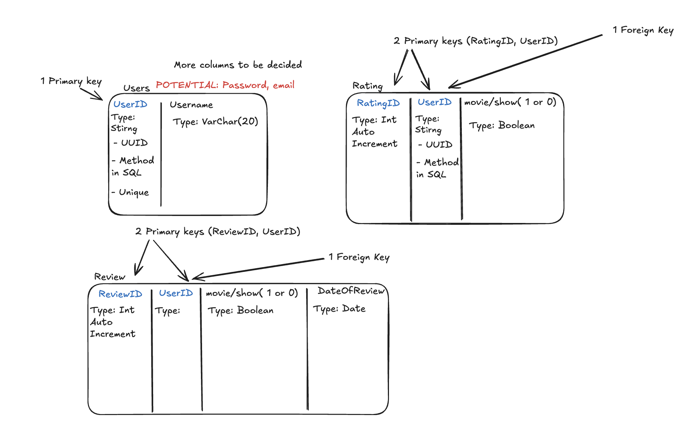
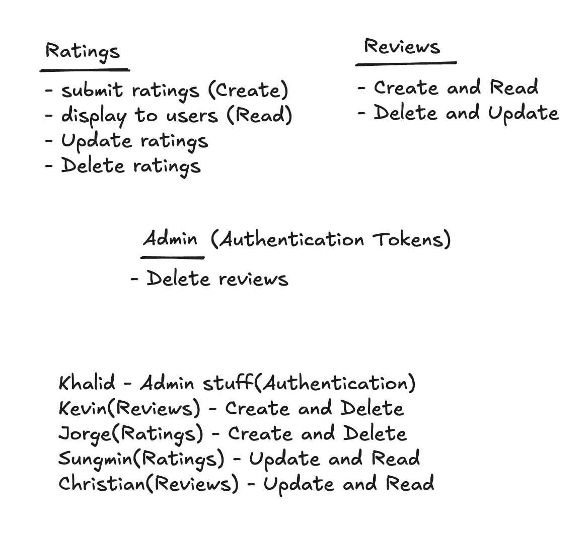
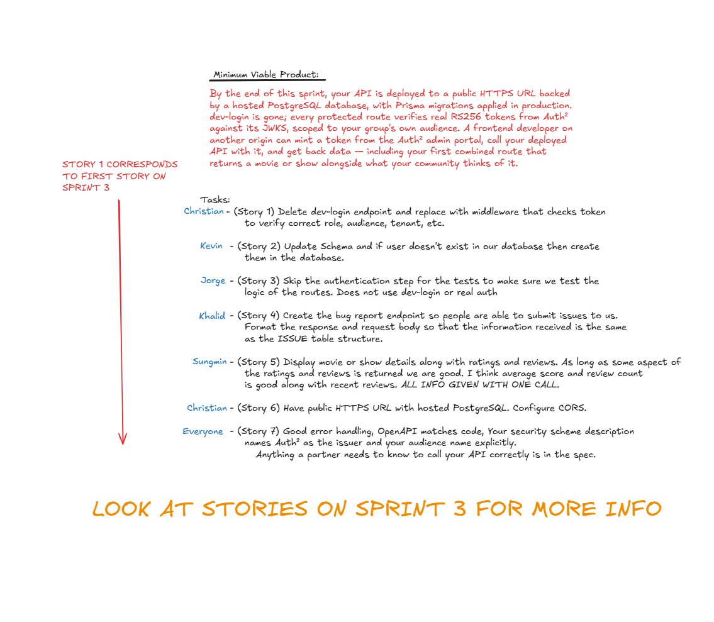
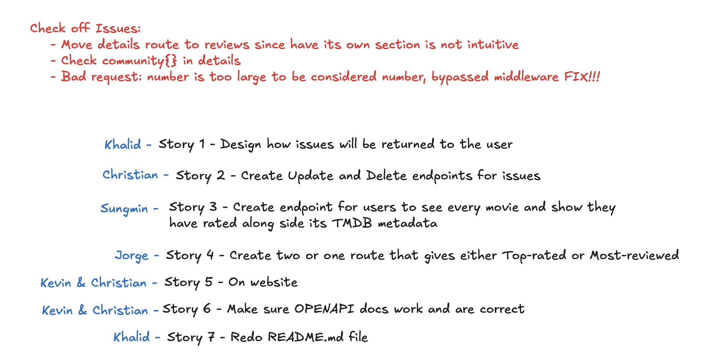
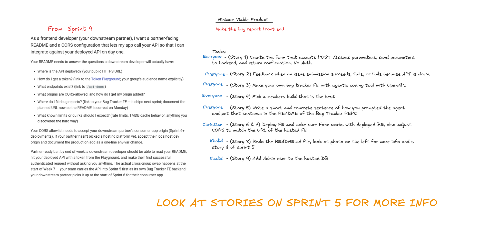

First Meeting Template

Agenda Item 1:
Decide on a Meeting Manager (This person is NOT the group leader. The meeting manager’s role is to keep the group on task during the meeting)

Meeting Manager: Christian

Agenda Item 2:
Decide on a Meeting Scribe (This person documents the meeting minutes. Group, help the scribe in their role. Keep your own notes. Work slowly enough so that the scribe may document the meeting)

Meeting Scribe: Khalid

Agenda Item 3:
Get to know each group member. Each group member answer (at least) the following questions:
(Scribe - put the answers for ALL group members in your meeting minutes.)

My name is Christian and I prefer to be called Christian. I took my freshman and sophomore
year at Green River College. My programming weakness is that I’m not too familiar with frontend
programming. I have a bit of experience in it but not much. My strength is that I have a good amount
of experience in backend programming. Other obligations that take time away from me to work on this project
are other courses, work, church activities, and family life. I enjoy weight lifting and traveling

My name is Jorge and I prefer to be called Jorge. I took 142/143 at UWT. I am strong in problem-solving
and anything mathematical and I'm weak in everything else. Other obligations that take time away from me
is spending time with family and other courses. I like soccer and hiking.

Sungmin Cha, Sungmin: I took 142/143 at 2022. I took them long time ago so I don't honestly believe they helped me prepare for this course.
I'm good at making structure and design but a bit weak at testing, micromanaging. I have a remote work and lots of
interview going on. I'm snowboarder. I got a week suspension from Crystal mt due to riding and being in closed route.

My name is Khalid Mohamed and I prefer to be called Khalid. I went to green river college for my freshman and sophmore year
and took 142 and 143 over there. My 142 and 143 courses at green river didnt really prepare me that much for this course other than laying
my foundation for my programming skills. All the course content is new to me when it comes to what I was taught in classes but not really new
to me based on what I did outside of classes. My programming strengths are my backend structure and understanding. One of my weaknesses is that
when it comes to laying down the first bone structure of projects Im usually the weakest link but once there is something to go off of, I catch up
and sometimes exceed my peers in. Some other obligations that take away time from my ability to work on this project for this class is work, working
on different projects for other courses since all my courses this quarter are group project based, taking care of my family at home, and having a social
life. Something I want others to know about me is I love playing roblox, volleyball and traveling outside the US.

Hey everyone, my name is Kevin and you can just call me that.
I went to Green River CC and also took 142&143 there.
It's been a very long time since I took those classes but they definitely helped
build a foundation for the rest of my classes. My strength is that I have experience
with OOP for backend; but my weakness is frontend but also getting lost often on knowing
what to do next. The obligations that take away time from allowing me to work include other
courses (writing-focused), and work. I've recently just picked up two new trading card games,
Yu-Gi-Oh and Digimon. I have played at least 7 different tcgs at this point.

Agenda Item 4:
Decide on a group structure.
Do you want to have a dedicated group leader?

Optional Group Leader: Christian

Who are the Subject Matter Experts (SME) for different areas? GUI, OO, Logic, Management, etc.
Students A and B pair program together while students C and D pair program together.
Student A is a dedicated tester/Unit test creator.
Consider your group's strengths and weaknesses. Pair a weak programmer with a strong programmer for pair programming sessions.
Who has Git experience and/or wants to dive into working with Git and GitHub to become the group's Git SME?
Etc.

Christian: Both

Jorge: Both

Khalid: Backend

Kevin: Frontend

Sungmin: Both

Unit Testing: Anyone with BOTH or BACKEND.

Agenda Item 5:
Discuss your concerns for the group project. Air any bad experiences from group work in the past. Discuss what you want to get out of this group project.
Discuss strategies you think can work for a successful group project.
(Document discussion from ALL members here)

I am concerned with the amount of work to be done in the amount of time given. I am worried about whether my experience will bring my team down.
I want to be able to create web applications for ideas in the future and learn different technologies. Getting started early on sprints will help
us be successful. Some concerns I have for the group project is if there will be enough things for 5 people to do to get meaningful experience out of.
Ive had good experiences with everyone in this current group even as former groupmates and I dont have any concern that we will be successful in the class.
What I want to get out of this project is more experience working with APIs and actually building a front end based on an API I didnt write.
Discuss your concerns: Group members not lifting a single finger when tasked with a specific task. Discuss what you want to get out of this project: I hope
to be able to apply web application concepts and design ideas for my personal projects in the future. Discuss strategies you think can work for a successful
group project: Having a breakdown of steps for the sprints for the week it is due.

Agenda Item 6:
The group needs to meet synchronously (online is OK) AT LEAST 3 times a Week. What times/days work for everyone?
https://www.when2meet.com/?36140886-gObUd

Agenda Item 7:
Wrap-up

Good introduction meeting getting to know each other and our schedules.

---

---

2nd Meeting, Week 3

- Discussing the structure of the endpoints. Created a schema.

- Considered different schema endpoints and went through all relevant TMDB api docs.

- Members spoke up and asked any confusions regarding routes.

3rd Meeting, Week 4

- Give everyone tasks for the week from the sprint

- Create db schema, made user, review, and rating tables

- Discuss the types for each column

4th Meeting, Week 5

- Gave everyone tasks for the week from the sprint

- Went over each task so gain an understanding of the MVP for the week

5th Meeting, Week 6

- Gave everyone tasks for the week from the sprint

- Went over each task so gain an understanding of the MVP for the week

6th Meeting, Week 7

Discussed about UberEATS and how much Khalid uses it.
Went through stories for sprint 5
Talked about Home Depot.
Christian did his first parallel parking.
Kevin doesn't want his car to be broken into.
Recapped last week's lecture about plans on frontend development.
Discussed AI options for generating frontend.
Talked about instructure paying the ransom fee.
Went into more detail about the stories.
Who does what story.
Talked about dates to finish by.

7th Meeting, Week 8

Sprint 6 Meeting (5/19)
Fixed issues from the last sprint (permissions issues, ui, and missing workflow.md files)
Went over sprint 6 specifications.
Tasked Jorge to break down the first story.
Went over how the collab group will access the bug tracker and back end.
Fixed environment variables.
Team trying to figure out what the stories are asking:

- Working with what group (N-1)
- Giving/asking the instructor for what info.
  Continued looking through the rest of the stories.
  Shared postresql.

8th Meeting, Week 9

Sprint 7 Meeting (5/26)

- Chatted about job hours and inventory etc..
- Summarized and broke down each story.
- Clarified some stories.
- Discussed where a user should be able to update/delete their review.
- Khalid joins call and notifies the group that he updated the colors.
- Kevin & Jorge call dibs on their stories.
- Khalid calls his dibs.
- Christian & Sungmin are quality checkers since they weren't assigned a specific story.
- Split stories into two.
- Recap and end of meeting.

**Retrospective Reflections**

1. What went well throughout this quarter was the consistency of the meetings and communication we did. This went for both
in-person and online meetings where we would typically have all five members. In the case someone couldn't make it or
had to leave early, we always made sure everybody was kept up to date with the responsibilities they were assigned for that week.
With five people, it did get a bit confusing at times when it came to bug fixing this and that but two or three people would
be in a call to walk through the issues, thus promoting an environment where members could talk and create a better product.

2. ???

3. Since every team was working from the same api source, we could get a grasp on what to use and expect. But what was the most interesting
were the methods the other team created that we didn't think of. It showcased their future proofing in ways we didn't account for and allowed
us to fix our own api and improve upon it.

With other people working on ours, we would come to know our shortcomings from their bug reports or suggestions on what could be included. What we
realized was that other groups had their own design philosphy or ideas that we didn't and never accounted for but this allowed for improvement.

4. AI can get out of hand and often times do too much. As some members have come across this, Cursor has other modes that allows for better and
more planned prompts. Overreliance on it can be detrimental and may cause deep-rooted issues but at the same time it can fill in knowledge gaps
the coder is lacking in.

